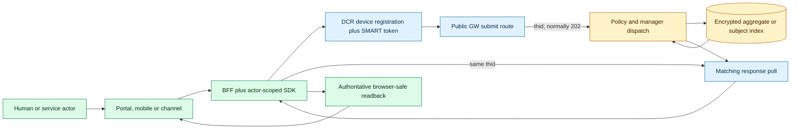
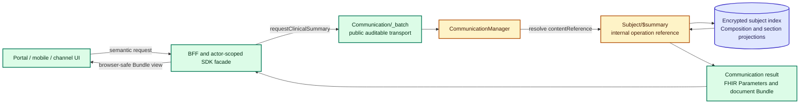
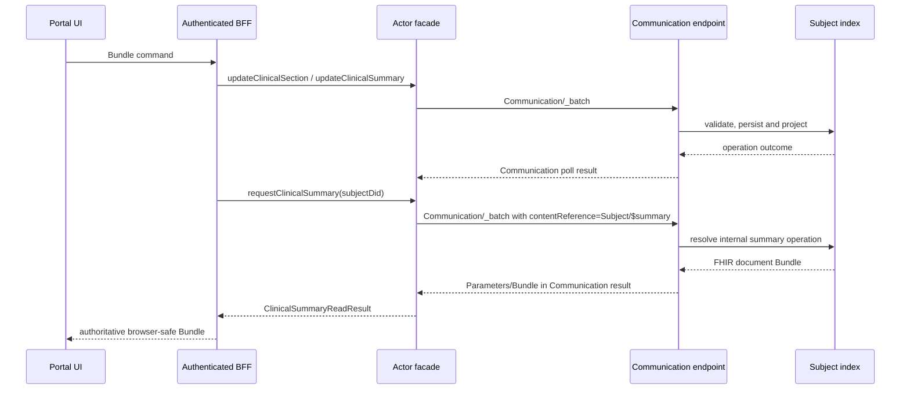

# GW CORE Contract Map

Status: Canonical integration boundary.

This map separates the API used by product code from the internal operation
names that GW resolves against a subject index. HTTP reachability does not make
a route part of the public application contract.

## Whole request lifecycle

The layers answer different questions:

1. Firebase or another application login identifies the human to its BFF; it
   is not automatically a clinical GW token.
2. DCR registers the actor device and SMART scopes the actor, subject and
   permitted operation.
3. The actor facade selects a semantic use case. Transport code submits one
   correlated request and polls its matching response with the same `thid`.
4. GW applies policy and dispatches to the relevant manager/store. A `202`
   means pending, never persisted success.
5. The application renders the final aggregate or an exact authoritative
   readback, not its submitted command.

## Clinical subject-index flow

The same rule applies when a `Communication` carries `Subject/_search` or
`Bundle/_search`: those values describe the requested internal operation. The
application does not construct a second direct HTTP call to that route.

## Contract levels

| Surface | Level | Who uses it | Meaning |
|---|---|---|---|
| Actor facade such as `requestClinicalSummary(...)` | Public application API | BFF/backend | Stable semantic use case; hides GW route and submit/poll details. |
| `Communication/_batch` and its poll route | Public GW transport | SDK runtime/BFF infrastructure | Auditable subject-index command or request channel. |
| `Communication/_search` | Public aggregate read | Actor facade/BFF | Communication inbox, history, correlation and request records. |
| `Subject/$summary`, `Subject/_search` | Internal operation reference | `CommunicationManager` and delegated managers | Operation selected by `Communication.contentReference`. |
| `Bundle/_search`, direct `Composition` routes | Compatibility/specialized | Migration, diagnostics and focused index tooling | Not the primary portal, mobile or telephone read contract. |
| `Organization/_search`, `License/_search` | Public administrative aggregate | Actor-scoped organization/controller facade | Administrative data, not clinical subject-index content. |
| `RelatedPerson/_search`, `Consent/_search` | Public aggregate read | Subject actor facade/BFF | Aggregate-specific authoritative readback. Mutations still travel in a Bundle attached to `Communication`. |

## Write and readback rule

Administrative aggregates do not pass through the clinical summary operation.
For example, organization and license capacity queries retain their dedicated
actor-scoped methods. A URL being under `/individual` does not by itself make
it clinical or require `$summary`.

The individual Organization owner directory is also administrative. A BFF may
search by the exact email and/or telephone already verified for its human
session and omit the nickname to receive a `Bundle` searchset containing all
matching individual Organizations. GW uses indexed equality queries and
deduplicates records carrying both contacts; it does not scan the collection.
This is card discovery, not wallet/device recovery and not clinical authority.

## OpenAPI interpretation

`/api-docs` shows a compact version of this map above the endpoint catalogue.
Use the CORE profile for application flows. Routes marked internal or
compatibility may remain in the reference/compatibility specifications because
the runtime still supports older clients and integration tests; they are not
recommendations for new application code.

The compact map also shows the four-step asynchronous lifecycle and stacks
vertically on narrow screens. Its text, numbered stages, contrast and semantic
list remain usable without relying on arrow direction or colour alone.
