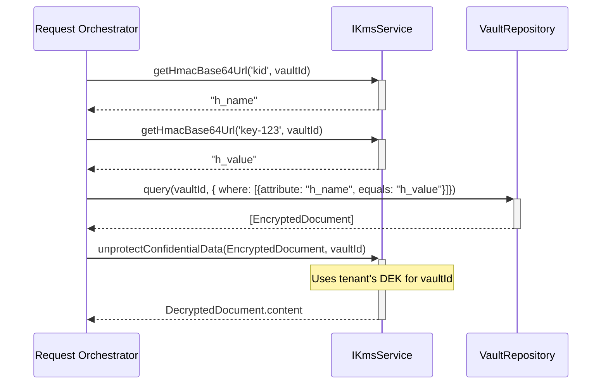
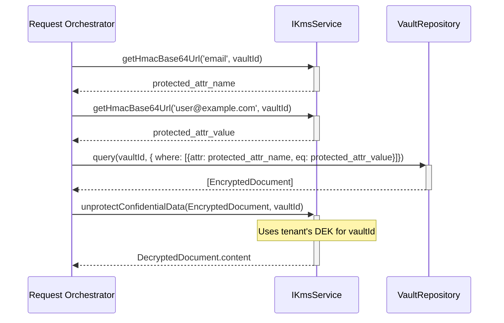

# Architecture Patterns

> ### Golden Rule: `didDocument.id` is the public resolvable `did:web`, `alsoKnownAs` contains aliases, and `serviceEndpoint` contains the real callable URL
>
> To align with interoperability standards like Gaia-X, the system's primary identifier for a DID Document (`didDocument.id`) **MUST** be a resolvable URL, specifically a `did:web`. This ensures that other systems can discover and interact with the entity using standard web protocols.
>
> Semantic URNs remain valid identifiers for claims and credentials, and they may appear in `alsoKnownAs` as aliases when useful. However, clients must not use `alsoKnownAs` for routing. The authoritative callable URLs are published in `didDocument.service[].serviceEndpoint`. The `iss` claim in a JWS should always be a resolvable `did:web`.

This document is the formal specification for the architecture. It is the definitive guide and "prompt" for all development.

## 1. Sovereign Identity with URNs & VCs

A strategic decision has been made to evolve the system's identity model to align with the principles of Self-Sovereign Identity (SSI), interoperability, and the standards promoted by European initiatives such as **Gaia-X** and the **International Data Spaces (IDS) Association**.

A based on `did:web` anchored to the provider's domain has limitations regarding data sovereignty and federation. In contrast, this model is based on three pillars: Semantic URNs, Verifiable Credentials (VCs), and a Blockchain (Hyperledger Fabric) as a trust layer.

### 1.1. The Identity Model: Semantic URNs

We implement semantic, persistent, and global **URNs (Uniform Resource Names)**. These URNs name entities based on verifiable, real-world attributes, not on internal identifiers.

The URN structure is configurable and follows a pattern like the one below:

`urn:<namespace>:<network>:<jurisdiction>:<version>:<sector>:entity:tax:<taxID>`

-   **Example for an Organization:**
    `urn:antifraud:test-network:cds-es:v1:health-care:entity:tax:B0011223344`
-   **Example for an Employee (hierarchical):**
    `urn:antifraud:test-network:cds-es:v1:health-care:entity:tax:B0011223344:employee:employee@example.com:role:isco-08|4110`

This approach ensures that a participant's identity is sovereign and machine-readable. By not depending on a specific web domain, it aligns with the decentralized principles of Self-Sovereign Identity (SSI) and the best practices defined by W3C, Gaia-X, and IDS.

### 1.2. Verifiable Credentials (VCs) as a Trust Container

The URN acts as the `ID` of a Verifiable Credential (VC). A VC is a digital document cryptographically signed by a trusted issuer (`Trust Anchor`) that certifies the claims about a subject.

-   **`issuer`:** A `Trust Anchor` (e.g., a government agency, an industry consortium) whose identity is registered on the trust layer.
-   **`subject`:** The entity identified by its URN.
-   **`claims`:** The data being certified in the `credentialSubject` property of the VC, using reverse-DNS based JSON flat properties (e.g., `org.schema.Organization.legalName = "ACME Hospital"`).

This model allows any network participant to cryptographically verify the authenticity of an organization's or employee's data without blindly trusting our system.

### 1.3. Blockchain (Hyperledger Fabric) as the Trust Layer

The permissioned blockchain network (Hyperledger Fabric) serves as the "ledger of trust" for the ecosystem. Its function is **not** to store user data, but to govern the system:

1.  **Registry of `Trust Anchors`:** It contains the registry of which entities are authorized to issue VCs.
2.  **VC Schema Management:** It stores and versions the data schemas that VCs must follow.
3.  **Revocation Lists:** It provides a secure and distributed mechanism to revoke credentials that are no longer valid.

Fabric channel names are derived from sector + jurisdiction. In the current backend routing this is implemented as a simplified scheme (e.g., `health-care-eu`, `insurance-global`) and may later evolve into fully-qualified names including environment/version (see `docs/04-DEEP-DIVES/04.H-DATASPACE-PUBLICATION-ATTESTATION.md`).

### 1.4. Impact on System Components

-   **`HostingManager`:** Responsible for creating the root URN for new organizations (`tenants`) that register on the network.
-   **`EmployeeManager`:** Uses the organization's URN to construct the hierarchical URN for employees.
-   **`TenantsCacheManager`:** Plays a crucial role. It does not cache the full "configuration" but acts as a fast ID resolver. It keeps an in-memory map from the internal tenantId (e.g., health-care.tenant-1) to the tenant's public URN. This optimizes performance by avoiding database queries to retrieve a tenant's sovereign identifier.
-   **`getTenantIdentifierUrn` function:** This helper function provides a clean interface for other managers to resolve a `tenantId` to its URN.

This design positions us as a service provider compatible with future European data spaces, ensuring maximum trust, security, and interoperability for our customers.

#### 1.5. Inbound Request Security: Authentication and Authorization

The system employs a multi-layered security model to handle different trust and integration scenarios. Every request undergoes two phases: **Authentication** (verifying the identity of the caller) and **Authorization** (verifying the caller has permission for the requested action).

The responsibility for these checks is strictly separated between the API Gateway and the asynchronous Business Logic Layer (Managers).

---

##### **Scenario A: Modern Security Flow (JWS Signature)**

This is the primary and most secure flow, mandatory for all critical operations, including **onboarding a tenant into a Hyperledger Fabric network (`test-network`)**.

**Phase 1: Authentication (API Gateway)**

The API Controller and KMS are responsible for cryptographic verification.

1.  **JWS Requirement:** The request MUST be a JSON Web Signature (JWS) signed by a controller (e.g., an employee).
2.  **KMS Verification:** The `api.ts` router passes the JWS to `kmsService.decodeJobRequest()`. The KMS is responsible for:
    *   Identifying the public key via the `kid` in the JWS header (e.g., `urn:ietf:rfc:7638:{thumbprint}`).
    *   Retrieving the full public key by querying the appropriate Manager (e.g., `EmployeeManager`).
    *   Performing the cryptographic signature verification.
    *   **If verification fails, the KMS MUST throw an exception.** The API controller catches this and returns **`401 Unauthorized`**.
3.  **Success:** If the signature is valid, the API proceeds. It has a cryptographic guarantee of the signer's key identity.

**Phase 2: Authorization (Business Logic Layer - Worker/Manager)**

Authorization is context-specific and handled by the Manager responsible for the action.

1.  **Job Queuing:** The authenticated `JobRequest` (containing the signer's `kid` in `meta`) is queued. The API returns `202 Accepted`.
2.  **Contextual Authorization in Manager:** The `NetworkEnrollmentManager` (as an example) is invoked by the worker. It performs the specific authorization for Fabric onboarding:
    *   It retrieves the DID Document of the **tenant** being onboarded.
    *   It checks if the **signer's `kid`** is listed in the tenant's `assertionMethod`. **This is the critical business rule for this flow**: only a pre-authorized "controller" key, explicitly delegated by the tenant, has the administrative privilege to manage its network credentials (like generating the Certificate Signing Request for Fabric).
    *   Other managers will have different rules. For instance, an `EmployeeManager` handling a request to create a new employee might only require that the signer has an "HR" role, which it would check by looking up the signer's own record in its database, not by checking the tenant's `assertionMethod`.
3.  **Outcome:** If the manager's authorization check fails, the job is marked as 'failed' with a **`403 Forbidden`** error.

---

##### **Scenario B: FHIR Legacy Flow (Bearer Token + On-Behalf-Of)**

To support integration with systems that do not use JWS signatures for every request (as is common in some FHIR profiles like the Australian Digital Health Agency's), the system provides a "legacy" flow. This flow is **ONLY** enabled for specific, configured FHIR endpoints.

1.  **Authentication (API Gateway):**
    *   The request MUST include a valid `Authorization: Bearer <token>` header. The token is typically an OAuth2 access token issued to the employee (e.g., containing their email in the `sub` claim).
    *   The API gateway validates this token against the Identity Provider (e.g., Google, Auth0). If the token is invalid or expired, it returns **`401 Unauthorized`**.
    *   The request body is a standard JSON payload, not a JWS.

2.  **Impersonation/Delegation:**
    *   To declare which employee is making the request (since there's no signature), the request **MUST** include a custom header, such as `On-Behalf-Of`, containing the employee's canonical identifier (e.g., their employee URN).
    *   The API gateway validates that the identity in the `On-Behalf-Of` header is consistent with the identity in the validated Bearer token (e.g., the URN's email matches the token's `sub` claim). If not, it returns **`403 Forbidden`**.

3.  **Job Queuing & Authorization (Worker/Manager):**
    *   A `JobRequest` is created. The `meta` field will not contain a `jws` object, but will contain information about the validated bearer token and the `On-Behalf-Of` identity.
    *   The job is queued, and the API returns `202 Accepted`.
    *   The responsible Manager in the worker performs authorization based on the **role associated with the `On-Behalf-Of` identity**, similar to the JWS flow.

This dual-mode approach provides a secure bridge for both modern, crypto-native clients and established enterprise systems, ensuring that all operations are auditable and secure regardless of the entry point.

## 2. Secure Asynchronous API Pattern

All asynchronous API endpoints that process sensitive data **MUST** follow this established architectural pattern to ensure security, scalability, and separation of concerns.

1.  **API Controller:** The controller is lightweight. Its primary role is to extract the encrypted message from the request and call `IKmsService.decodeRequest()` on the incoming payload. This results in a `IDecodedDidcommPayload`.

2.  **Job Queuing:** The controller creates a `JobRequest` (containing the `IDecodedDidcommPayload`) and places this job into a queue. It immediately returns a `202 Accepted` response, including the `thid` from the decoded job for correlation.

3.  **Worker:** A separate Worker process dequeues the job and calls the appropriate business-logic `Manager` (e.g., `OrganizationManager`) to execute it.

4.  **Response Payload Creation:** The Manager executes the business logic and constructs a complete, JARM-compliant `IDecodedDidcommPayload` object. This object contains the final `Bundle` of results.
5.  **Response Encoding:** The Worker receives the `IDecodedDidcommPayload` from the manager and **MUST** call `IKmsService.encodeResponse()` to encrypt this payload for the intended recipient(s).

6.  **Response Storage:** The Worker stores the final, encrypted response (the `secureEnvelope`) in a temporary key-value store (e.g., Redis, Firestore), using the `thid` as the key.

7.  **Polling:** A separate polling endpoint is responsible for retrieving the stored, encrypted response when requested by the original client using the `thid`.

This pattern ensures that no sensitive plaintext data is ever held in the API controller and that all business logic is executed in the background, decoupled from the initial client request.

### 2.1. Exception for Plaintext Requests (The "Encrypt-to-Self" Pattern)

A critical architectural rule is that **all job results MUST be stored as encrypted JWEs** in the response store. This ensures a consistent and secure format for data at rest. However, the system must also support clients that submit unencrypted, plaintext JSON requests (e.g., with `Content-Type: application/json`).

To handle this, the system uses an **"encrypt-to-self"** pattern for plaintext requests:

1.  **Worker-Side Encryption:** When the worker processes a job from a plaintext request (identified by its `Content-Type`), it still calls `IKmsService.encodeResponse()`. However, since the client did not provide a public key, the worker encrypts the response using the public key(s) of the **tenant processing the job**. The tenant effectively becomes the recipient of its own message.
    -   **Special Case (Onboarding):** For a new tenant registration, the response is encrypted for the **newly created tenant**.

2.  **Polling Handler Decryption:** The `pollingHandler` is responsible for completing the flow. It inspects the original `Content-Type` of the stored job.
    -   If the original request was JSON-based, the handler **MUST decrypt** the JWE it retrieves from the response store before sending the final plaintext JSON payload back to the client.
    -   If the original request was encrypted, it sends the JWE directly to the client.

This pattern ensures that clients who send JSON receive JSON, seamlessly abstracting the internal security measure of encrypting all asynchronous results at rest.

## 3. Key Hierarchy and Envelope Encryption

The system employs a multi-level **envelope encryption** strategy to ensure robust security and cryptographic isolation for data at rest. This pattern ensures that a compromise of one layer does not automatically compromise the entire system.

The hierarchy is as follows:

### 3.1. Level 0: Key Encryption Key (KEK)

-   **Role**: The single master key for the entire system. It is the root of trust.
-   **Source**: The KEK is considered a "root secret" and is **never** stored in the application's database. It MUST be provided from a secure, external source, such as an environment variable (`KEK_SECRET`) or a dedicated secret manager (e.g., Google Secret Manager, AWS KMS, HashiCorp Vault).
-   **Function**: Its sole purpose is to encrypt and decrypt the **Host DEK**. It never touches tenant data or configurations directly.

### 3.2. Level 1: Host Data Encryption Key (DEK)

-   **Identifier**: The `entityId` for the host is the literal string `'host'`.
-   **Protection**: The Host DEK is encrypted at rest by the **KEK**. It is the only key protected by the KEK.
-   **Function**: The Host DEK serves two critical functions:
    1.  It encrypts the host's own internal data and configuration (e.g., its own `TenantConfig` document).
    2.  It acts as a "key-wrapping" key to encrypt the DEKs of all other tenants.

### 3.3. Level 2: Tenant Data Encryption Key (DEK)

-   **Identifier**: The `entityId` for a tenant is its unique resource UUID (e.g., `c1c2c3d4-e5f6...`).
-   **Protection**: Each Tenant DEK is encrypted at rest by the **Host DEK**.
-   **Function**: A Tenant DEK is used to encrypt all of that specific tenant's data (e.g., employees, customers, etc.) within that tenant's dedicated vault.

### 3.4. Data Protection Flow Diagram

This flow ensures that to access a tenant's data, an attacker would need to compromise multiple, independent keys.

## 4. The Original Asynchronous API Flow (Detailed View)

This section provides a more detailed view of the flow described above.
1.  **Request:** The client `POST`s a **DIDComm Message Envelope**.
2.  **Security Middleware & Decoding:** The **API Router** passes the message to the `IKmsService` to get a plaintext `IDecodedDidcommPayload`.
3.  **Validation & Queuing:** The **API Router** creates a `JobRequest` and pushes it into the **Queue**.
4.  **Immediate Response (`202 Accepted`):** The client immediately receives a `202 Accepted` response with the `thid`.
5.  **Background Processing:** The **Worker** picks up the job and calls the appropriate **Manager**.
6.  **Business Logic & Response Creation:** The **Manager** executes the business logic and builds the final `IDecodedDidcommPayload` object.
7.  **Response Encoding:** The **Worker** receives the `IDecodedDidcommPayload` and passes it to `IKmsService.encodeResponse`.
8.  **Response Storage:** This final, encrypted envelope is stored in the `ResponseStore`, keyed by the `thid`.
9.  **Polling for Results:** The client polls for and receives the final encrypted `IDecodedDidcommPayload`.
**Important Exception:** The `/.well-known` endpoints for public key and DID discovery are *synchronous*.

## 5. API Structure

The API is divided into two main categories of endpoints: asynchronous operations for business logic and synchronous endpoints for public data discovery.

### 5.1. Asynchronous Operations

-   **Structure:** `POST /{tenantId}/cds-{jurisdiction}/v1/{sector}/{section}/{format}/{resourceType}/{action}`
-   **Breakdown:**
    -   `tenantId`: Canonical tenant identifier (`Organization.identifier.value`) of the entity responsible for the operation (e.g., `host`, `acme-id`).
    -   `cds-{jurisdiction}`: This segment serves two purposes.
        1.  **`cds`**: Stands for **Consumer Data Standards**. It acts as a namespace to signal that the API will conform to architectural principles of data standards, focusing on data portability, security, and interoperability.
        2.  `{jurisdiction}`: The two-letter country code (e.g., `es`, `us`) for the legal jurisdiction under which the data is being processed.
    -   `v1`: The major version of the API.
    -   `{sector}`: The business sector (e.g., `health-care`, `test`).
    -   `{section}`: The API section (e.g., `entity`, `individual`, `registry`).
    -   `{format}`: The data schema being used (e.g., `org.schema`, `org.hl7.fhir.r4`).
    -   `{resourceType}`: The primary resource being acted upon (e.g., `Organization`, `Employee`).
    -   `{action}`: The operation being performed (e.g., `_batch`, `_search`).

### 5.2. Synchronous Discovery

*   **Asynchronous Operations:** `POST /{tenantId}/cds-{jurisdiction}/v1/{sector}/{section}/{format}/{resourceType}/{action}`
*   **Synchronous Discovery:** `GET /{tenantId}/.well-known/{file}`

## 6. The Manager Contract

*   **Input:** A canonical `JobRequest` object, which contains the full context of the request, including the decoded DIDComm message (`job.input`).
*   **Output:** A `Promise<IDecodedDidcommPayload>`. The `IDecodedDidcommPayload` object is a complete, JARM-compliant payload ready to be secured by the worker.
*   **Responsibility:** Pure, format-agnostic business logic **AND** construction of the final response payload. The manager is responsible for building the entire `IDecodedDidcommPayload`, including the `thid`, JARM claims (`iss`, `aud`, `exp`), and the response `body` (which contains the final `Bundle`).

### 6.1. Response Bundle Type

The `type` field of the `Bundle` within the returned `IDecodedDidcommPayload.body` **MUST** be determined by the `action` of the original request. This logic is centralized in the `getBundleResponseTypeForAction` utility. The mapping follows a semantic principle:

*   **Read/Query Operations (`_search`, `_history`):** Result in a `searchset` bundle.
*   **Atomic Transactions (`_transaction`, `_seal`):** Result in a `transaction-response` bundle.
*   **Independent Batch Operations (`_batch`, `_verify`):** Result in a `batch-response` bundle.

## 7. The `BundleEntry` Contract

*   The `claims` for business logic **MUST** be located in `entry.meta.claims`.
*   The `entry.resource` contains the original resource for auditing and reference.

### 7.1. Entry `type` Naming Convention

The `entry.type` field is the definitive identifier for the business operation or "form" being submitted. Its value **MUST** follow a standardized format inspired by established standards like openEHR's template naming.

*   **Structure:** `<UseCase>-<Action>-form-v<Major>.<Minor>`
*   **Examples:**
    *   `Organization-registration-form-v1.0`
    *   `Employee-update-form-v2.1`
    *   `Credential-revocation-request-v1.0`

**Rationale:**

1.  **Unambiguous Identification:** This format clearly identifies the business process and the specific version of the data schema/rules being used.
2.  **Versioning:** Including the version directly in the `type` allows managers to implement version-specific logic, ensuring backward compatibility as forms and processes evolve.
3.  **Clarity over Redundancy:** This convention centralizes the operation's identity in a single field, avoiding the need for redundant fields like `meta.templateId` or `meta.templateVersion`.

## 8. The Worker's Responsibilities

1.  **Normalize Input:** The first crucial step is to normalize any incoming `Bundle` into the canonical internal format. This means that if the original bundle follows the FHIR standard (using an `entry` array), it **MUST** be converted to the internal standard which uses a `data` array (inspired by JSON:API). This ensures managers always receive a consistent data structure.
2.  **Route Jobs:** Call the correct manager based on the `JobRequest`.
3.  **Secure and Store Output:** Take the complete `IDecodedDidcommPayload` from the manager and pass it to `IKmsService` for signing and/or encryption. The resulting secure envelope is then stored in the `ResponseStore`. The worker **DOES NOT** format the response payload; it only orchestrates its security and storage.

## 9. Universal Naming Convention

To ensure traceability and consistency, the system uses a universal naming convention for asynchronous events, whether they are jobs in the queue or message threads. All naming logic is centralized in `src/utils/naming.ts`.

### 9.1. Job Names

*   **Purpose:** To create a unique, sortable, and informative name for a job in the queue. This name facilitates routing, debugging, and prioritized processing.
*   **Structure:** `<priority>-<timestamp>:<tenantId>:<resourceType>:<action>`
*   **Priority:** Based on a Triage scale, similar to the Manchester Triage System (MTS), where 1 is the highest priority and 5 is the lowest. Defaults to 5 if not specified in the job payload.
*   **Example:** `5-1678886400000:host:Organization:batch`
*   **Implementation:** The `ApiRouter` **MUST** use `createJobName()` to generate the name. The `Worker` **MUST** use `parseJobName()` to analyze the name and route the job.

### 9.2. Messaging Section IDs

*   **Purpose:** To uniquely identify a conversation thread (e.g., an inbox or sent folder) within a messaging vault (like a `Group` or `List`).
*   **Structure:** `<timestamp>_<parentId>_<destinationId>_<type>`
*   **Example:** `1678886400000_group123_member456_inbox`
*   **Implementation:** A future `MessagingManager` **MUST** use `createMessageSectionId()` to generate these identifiers.

## 10. Data Storage Patterns

The entire data persistence layer is abstracted to ensure business logic remains agnostic to the underlying database technology (e.g., in-memory for testing, Firestore for production).

*   **The Repository Pattern:** All direct database interactions are encapsulated within **Repositories**. A repository defines a contract (an interface) for a specific domain entity (e.g., `VaultRepository`, `ConsentRepository`).
*   **Agnostic Managers:** Managers **MUST NOT** interact directly with any database driver (like Firestore or Mongo). They **MUST** only depend on the repository interfaces.
*   **The `VaultRepository` Contract:** This is the primary storage abstraction, evolving from the original `DatabaseAbstract`. It defines the core methods for interacting with the confidential storage system, such as `createNewVault`, `put` (to add records to a section), `get`, `getAllSections`, etc.
*   **Implementation Injection:** The specific implementation of a repository (e.g., `VaultMemRepository` or `VaultFirestoreRepository`) is injected into the managers at runtime, allowing the application to switch between storage backends without changing any business logic.

This pattern is fundamental to the system's testability and future-proofing. For detailed instructions on how to correctly implement tests that involve this dependency injection, see the **[Testing Patterns and Best Practices Guide (`src/docs/guides/testing-patterns.md`)(./docs/guides/testing-patterns.md)**.

## 11. Phase 2: The Persistent Messaging Model (Inbox/Sent)

Once the core asynchronous API is stable, the next architectural layer is the implementation of a persistent, DIDComm-based messaging system. The temporary `ResponseStore` used for polling is **NOT** part of this system.

*   **Core Concept:** `Groups` and `Lists` are not just resources; they are **vaults** that can contain message threads.
*   **DIDComm Alignment:**
    *   `pthid` (Parent Thread ID): This will correspond to the `vaultId` of the `Group` or `List` where the conversation is happening.
    *   `thid` (Thread ID): This will correspond to a `section` within the parent vault, representing a specific conversation.
*   **Data Structure (Sections):**
    *   Within a messaging vault (a `Group` or `List`), data will be partitioned into `inbox` and `sent` sections.
    *   The section names will follow a specific convention, allowing for messages to be routed to/from specific members or other groups.
*   **Example Section IDs:** `"<vaultId>_inbox_<member-or-groupId>"` or `"<vaultId>_sent_<member-or-groupId>"`.
*   **Workflow:**

    1.  The `Worker` processes a job and gets a final `Bundle` response.
    2.  In addition to storing the result in the temporary `ResponseStore`, the `Worker` passes the `Bundle` to a future `MessagingManager`.
    3.  The `MessagingManager` analyzes the `Bundle` to determine the sender and recipients and writes the message to the appropriate `inbox` and `sent` sections in the corresponding vaults.

---

## 12. Resource Identification and Normalization

This section defines the canonical process for handling resource identifiers within the system, ensuring a clear distinction between internal database IDs and public business identifiers.

### 12.1. Core Principles

- **Internal ID (`id`):** Every resource object (Organization, Person, etc.) in a response payload MUST have a top-level `id` field. This `id` MUST be a pure, non-prefixed UUID (e.g., `"a1b2c3d4-..."`). It is used for database indexing, foreign key relationships, and unambiguous internal referencing.

- **Public Identifier (`identifier` claim):** This is the identifier provided in the incoming claims (e.g., from a registration form).
    - Its primary format is a URN, typically `urn:uuid:<value>`.
    - It represents the "source of truth" for the resource's identity at the time of the request.

- **Business Identifiers (`taxID`, etc.):** These are critical public identifiers used for business-level validation and lookup (e.g., ensuring an organization with a specific `taxID` and `country` is unique). They are preserved as-is but are NEVER used as the internal resource `id`.

### 12.2. The Normalization Flow

To ensure data consistency, the following flow is mandatory when processing resources from claims:

1.  **Determine the Internal `id`:** The internal `id` (the pure UUID) is derived from the `org.schema.<Type>.identifier` claim using the `determineResourceId` utility. This utility is responsible for:
    - Extracting the UUID from a valid `urn:uuid:<value>` string.
    - Generating a new UUID if the claim is missing or invalid.
    - Accepting non-UUID identifiers in `demo` mode.

2.  **Normalize the `identifier` Claim:** Once the internal `id` (the pure UUID) is determined, the original `org.schema.<Type>.identifier` claim within the resource's `meta.claims` object **MUST BE OVERWRITTEN**.

3.  **Create the Canonical URN:** The new value for the `identifier` claim is created by passing the determined internal `id` to the `createUrnFromUuid` utility.

**Example:**

- **Incoming Claim:** `org.schema.Person.identifier: "urn:uuid:a1b2c3d4-..."`
- **Processing Result:**
    - `Person.id`: `"a1b2c3d4-..."` (derived by `determineResourceId`)
    - `Person.meta.claims['org.schema.Person.identifier'`: `"urn:uuid:a1b2c3d4-..."` (re-created and normalized by `createUrnFromUuid`)

---

## 13. Secure Persistence Flow

This pattern describes the mandatory sequence of operations a manager must follow to persist a sensitive document securely in a vault, ensuring separation of concerns between business logic, security, and storage.

### 13.1. Actors

-   **Manager** (e.g., `OrganizationManager`): Knows the business logic. Responsible for creating the business data (the `content`) and its searchable indexes (`indexed`).
-   **IKmsService** (Key Management Service): Knows how to secure data for a tenant. Manages key access and orchestrates encryption.
-   **VaultRepository**: Knows how to write data to the underlying storage. It is "dumb" regarding cryptography.

### 13.2. Sequence

1.  **Manager: Construct Plaintext Document**
    - The manager creates a complete `ConfidentialStorageDoc` object.
    - It populates the `indexed` array with the necessary searchable attributes.
    - It populates the `content` property with the full, sensitive business object (e.g., `TenantConfig`). The `jwe` property is left empty.

2.  **Manager: Request Protection from KMS**
    - The manager calls `await this.kmsService.protectDocument(docToProtect, tenantId)`.
    - It passes the entire plaintext document and the ID of the tenant who will own the data.

3.  **KMS: Perform Encryption**
    - The `IKmsService` implementation receives the document.
    - It takes the `doc.content` object and serializes it (e.g., `JSON.stringify`).
    - It calls its internal, low-level crypto engine (`ICryptography.encrypt`) to turn the serialized `plaintext` into a `JWEData` object.
    - It creates a new "secure" document by copying the original, setting the `jwe` property with the result, and **deleting the `content` property**.
    - It returns this new secure document to the manager.

4.  **Manager: Persist Secure Document**
    - The manager receives the secure document from the KMS.
    - It calls `await this.vaultRepository.put('vault', [secureDoc], 'section')`, passing the secure document to the storage layer.

### 13.3. Result

The data is stored securely at rest. The `content` only ever exists in memory within the KMS's secure boundary during the encryption process, and the repository only ever sees the encrypted `jwe` object.

---

## 14. Data Handling and Serialization

To ensure interoperability and prevent subtle bugs during cryptographic operations, all modules **MUST** adhere to the following data handling principles when converting between strings and bytes (`Uint8Array`).

### 14.1. Serialization (Going "Out")

-   **Context:** Preparing data to be sent, signed, or encrypted. This includes creating JWT payloads, DIDComm message bodies, and any data that will be persisted.
-   **Rule:** When converting a JavaScript object or string into a JOSE-compatible format, the data MUST be UTF-8 encoded and then Base64URL encoded without padding.
-   **Workflow:** `Object` -> `JSON.stringify()` -> `stringToBytesUTF8()` -> `bytesToRawBase64UrlSafe()` -> `string (Base64URL)`
-   **Rationale:** This ensures that all outgoing data is standards-compliant and unambiguously encoded as UTF-8, which is the expected format for JSON-based protocols like JOSE and DIDComm, before its final Base64URL representation.

### 14.2. Deserialization (Coming "In")

-   **Context:** Processing data that has just been received, decrypted, or decompressed. This includes handling JWT payloads and the output of libraries like `pako`.
-   **Rule:** When converting a Base64URL string back into a JavaScript object, it must first be decoded from Base64URL to bytes. Then, a **permissive ASCII/binary decoder (`bytesToStringASCII`) MUST be used** to convert the bytes to a string for parsing.
-   **Workflow:** `string (Base64URL)` -> `base64ToBytes()` -> `Uint8Array` -> `bytesToStringASCII()` -> `string` -> `JSON.parse()` -> `Object`
-   **Rationale:** Cryptographic and compression libraries operate on raw binary streams. Their output is not guaranteed to be a strictly valid UTF-8 byte sequence. A permissive decoder is required to robustly handle this data and prevent parsing failures after Base64URL decoding.

## 15. Secure Query Pattern

This pattern defines the mandatory, secure process for querying sensitive, encrypted documents based on indexed attributes (e.g., finding an employee by their `kid`). It strictly enforces the separation of concerns, ensuring that only the KMS handles cryptographic secrets and that the storage layer remains "cryptographically blind".

### 15.1. Actors

-   **Request Orchestrator** (e.g., `ApiRouter`, a specific `Manager`): The component that needs to find a document. It knows the business logic of the query (e.g., "I need to find the employee with this `kid`") but has **no access** to any cryptographic keys.

-   **IKmsService** (The "Cryptographic Oracle"): The only component with access to tenant-specific secrets, including the HMAC keys used for indexing. Its responsibility is to protect and unprotect data, **not** to perform storage operations.

-   **VaultRepository** (The "Blind Store"): The storage abstraction layer. It performs queries by comparing the HMAC-protected values provided by the orchestrator against the HMAC-protected values stored in the index. It has **no knowledge** of the underlying plaintext values or the HMAC keys.

### 15.2. Sequence of Operations

The flow ensures that plaintext query values are never exposed to the storage layer and that the KMS never needs to know the details of the storage implementation.



1.  **Orchestrator Prepares Query:** The orchestrator determines the `vaultId` and the plaintext query parameters (e.g., `name: 'kid'`, `value: 'some-key-id'`).

2.  **Orchestrator Requests HMAC Protection:** It calls the KMS to separately protect the attribute name and value.
    ```typescript
    const protectedAttrName = await kmsService.getHmacBase64Url('kid', vaultId);
    const protectedAttrValue = await kmsService.getHmacBase64Url('some-key-id', vaultId);
    ```

3.  **KMS Returns Protected Values:** The KMS uses the specific HMAC key associated with the `vaultId` to compute the hashes and returns them to the orchestrator.

4.  **Orchestrator Queries the Vault:** The orchestrator uses these protected, opaque strings to build and execute a query against the `VaultRepository`.
    ```typescript
    const encryptedDocs = await vaultRepository.query(vaultId, {
      where: [{ attribute: protectedAttrName, equals: protectedAttrValue }]
    });
    ```

5.  **Vault Returns Encrypted Document(s):** The repository finds matching records based on the HMACed index and returns the full, encrypted `ConfidentialStorageDoc` object(s).

6.  **Orchestrator Requests Decryption:** The orchestrator passes the encrypted document and the `vaultId` to the KMS to get the plaintext content.
    ```typescript
    const employeeConfig = await kmsService.unprotectConfidentialData(encryptedDocs[0], vaultId);
    ```

### 15.3. Architectural Guarantees

-   **Zero-Knowledge Storage:** The storage layer (`VaultRepository`) never sees plaintext data or query values.
-   **Separation of Concerns:** The KMS handles only cryptography. The orchestrator handles only business flow. The repository handles only storage.
-   **Security:** A compromise of the database does not reveal the content of the data or the nature of the queries being performed. An attacker would still need to compromise the KMS and its keys.

## 15. Secure Query Pattern

This pattern defines the mandatory, secure process for querying sensitive, encrypted documents based on indexed attributes (e.g., finding an employee by their `kid`). It strictly enforces the separation of concerns, ensuring that only the KMS handles cryptographic secrets and that the storage layer remains "cryptographically blind".

### 15.1. Actors

-   **Request Orchestrator** (e.g., `ApiRouter`, a specific `Manager`): The component that needs to find a document. It knows the business logic of the query (e.g., "I need to find the employee with this `kid`") but has **no access** to any cryptographic keys.

-   **IKmsService** (The "Cryptographic Oracle"): The only component with access to tenant-specific secrets, including the HMAC keys used for indexing. Its responsibility is to protect and unprotect data, **not** to perform storage operations.

-   **VaultRepository** (The "Blind Store"): The storage abstraction layer. It performs queries by comparing the HMAC-protected values provided by the orchestrator against the HMAC-protected values stored in the index. It has **no knowledge** of the underlying plaintext values or the HMAC keys.

### 15.2. Sequence of Operations

The flow ensures that plaintext query values are never exposed to the storage layer and that the KMS never needs to know the details of the storage implementation.



1.  **Orchestrator Prepares Query:** The orchestrator determines the `vaultId` and the sensitive, plaintext query parameters (e.g., `name: 'email'`, `value: 'user@example.com'`).

2.  **Orchestrator Requests HMAC Protection:** It calls the KMS *separately* for the attribute name and value to get their protected (hashed) counterparts.
    ```typescript
    const protectedAttrName = await kmsService.getHmacBase64Url('email', vaultId);
    const protectedAttrValue = await kmsService.getHmacBase64Url('user@example.com', vaultId);
    ```

3.  **KMS Returns Protected Values:** The KMS uses the specific HMAC key associated with the `vaultId` to compute the hashes and returns them to the orchestrator.

4.  **Orchestrator Queries the Vault:** The orchestrator uses these protected, opaque strings to build and execute a query against the `VaultRepository`.
    ```typescript
    const encryptedDocs = await vaultRepository.query(vaultId, {
      where: [{ attribute: protectedAttrName, equals: protectedAttrValue }]
    });
    ```

5.  **Vault Returns Encrypted Document(s):** The repository finds matching records based on the HMACed index and returns the full, encrypted `ConfidentialStorageDoc` object(s).

6.  **Orchestrator Requests Decryption:** The orchestrator passes the encrypted document and the `vaultId` to the KMS to get the plaintext content.
    ```typescript
    const employeeConfig = await kmsService.unprotectConfidentialData(encryptedDocs[0], vaultId);
    ```

### 15.3. Architectural Guarantees

-   **Zero-Knowledge Storage:** The storage layer (`VaultRepository`) never sees plaintext data or query values.
-   **Separation of Concerns:** The KMS handles only cryptography. The orchestrator handles only business flow. The repository handles only storage.
-   **Security:** A compromise of the database does not reveal the content of the data or the nature of the queries being performed. An attacker would still need to compromise the KMS and its keys.

## 16. DID Document Generation Strategy

The system employs a clear, two-stage process for generating `did:web` DID Documents. This strategy separates the definition of logical business capabilities from the final, publicly resolvable service endpoints, ensuring both architectural clarity and adherence to W3C standards.

### 16.1. The Two Key Components

1.  **`didConfig.service` (The Logical Template):**
    *   **Purpose:** This array, stored within the `EntityConfig` of a host or tenant, defines the **logical business services** the entity offers. It is the "source of truth" for the entity's capabilities.
    *   **Service ID Format:** The `id` for these services is a **programmatic identifier** that directly mirrors the structure of the API path. It is generated by the `createDidServiceIdBase` utility (e.g., `v1:health-care:entity:org.schema`). This ID is used **internally** by the API router to authorize incoming requests. The `format` component **MUST** use Reverse DNS notation (e.g., `org.schema`).
    *   **`serviceEndpoint`:** For these services, this field does not contain a URL. Instead, it holds a comma-separated list of resource types permitted for that API route (e.g., `"Employee,Practitioner,Organization"`).
        > **Note:** Resource type names use PascalCase (e.g., `Employee`) to align with the naming conventions of their source schemas (Schema.org and HL7 FHIR). The gateway's routing logic performs a case-insensitive comparison to match incoming URL paths (e.g., `/.../employee/...`).

2.  **`didDocument.service` (The Final Public Document):**
    *   **Purpose:** This is the final, complete `service` array that is exposed publicly in the entity's `did.json`. It combines the logical business services with standardized discovery services.
    *   **Generation:** This array is assembled by the `populateDidDocumentServices` utility function.

### 16.2. The Assembly Process

The `HostingManager` orchestrates the generation process when a new host or tenant is created:

1.  **Initialize Logical Services:** The manager calls `initializeHostServicesConfig` or `initializeTenantServicesConfig` to generate the array of logical business services. This array is stored in `didConfig.service`.

2.  **Determine the Authoritative `baseUrl`:**
    *   The `HostingManager` is responsible for determining the correct, resolvable base URL for the entity.
    *   For the **host**, this is the gateway's own `apiBaseUrl`.
    *   For a **tenant**, the manager first checks for a custom external domain in the tenant's claims (`org.schema.Organization.url`). If present, that URL is used. If not, a "hosted" URL is constructed on the gateway (e.g., `https://api.gateway.com/tenant-name`).

3.  **Populate Final Services:** The manager calls `populateDidDocumentServices`, passing it three key arguments:
    *   `did`: The entity's canonical `did:web` identifier.
    *   `baseUrl`: The authoritative base URL determined in the previous step.
    *   `businessServices`: The logical services array from `didConfig.service`.

4.  **Assemble the Final Document:** The `populateDidDocumentServices` function performs two key actions:
    *   It creates the **standard discovery services** (`LinkedDomains`, `JsonWebKeyService2020`).
        *   The `id` of these services is built using the `did` (e.g., `did:web:acme.com#jwks`), following the W3C convention. This is the **"WHAT"**.
        *   The `serviceEndpoint` of these services is built using the `baseUrl` (e.g., `https://acme.com/jwks.json`), providing the resolvable location. This is the **"WHERE"**.
    *   It merges these standard services with the business logic services passed into it.

This clear separation of concerns ensures that business logic is defined independently of its final deployment location, making the system more flexible and maintainable.

---

## 17. KMS Security Model and Key Resolution

The Key Management Service (`KmsService`) is the cryptographic heart of the gateway, designed around two distinct but related responsibilities: **performing secure operations with private keys** and **resolving public keys** of other entities.

### 17.1. Secure Private Key Operations (The "Vault" Function)

The primary role of the `KmsService` is to act as a secure, in-memory vault and cryptographic engine.

-   **Security Principle:** Private keys (for signing and decryption) managed by the gateway **never leave the `KmsService` boundary**. They are loaded into an in-memory map (`_managedKeys`) at provisioning time and are never written to disk, logged, or returned to any caller.
-   **Operation Flow:** Business logic managers (e.g., `CredentialManager`) do not handle keys directly. Instead, they request a cryptographic operation by passing the plaintext data and the identifier of the entity that should perform the action (the `entityVaultId`). The `KmsService` uses the `entityVaultId` to look up the correct private key internally, performs the operation (e.g., `signWithManagedKey`), and returns only the result (e.g., the JWS).
-   **Architectural Guarantee:** This model ensures that even a compromised manager or component cannot leak private keys, as they simply do not have access to them. The KMS is the sole guardian of the gateway's private key material.

### 17.2. Public Key Resolution Strategy (The "Resolver" Function)

To encrypt data for others or to verify incoming signatures, the `KmsService` must be able to resolve public keys. This follows a resilient, multi-stage lookup pattern.

#### Stage 1: Local Tenant Resolution (Lazy-Loading Cache)

-   **Context:** Resolving public keys for tenants that are **managed by this gateway**.
-   **Function:** When a public key is requested (e.g., `getPublicEncryptionKey(tenantVaultId)`), the `KmsService` first queries the `TenantsCacheManager` for the tenant's `didDocument`. The `TenantsCacheManager`, in turn, lazy-loads the tenant's configuration from the database if it's not already in its own cache. The `KmsService` then extracts the required public key from the `verificationMethod` or `keyAgreement` sections of the DID Document.
-   **Rationale:** This makes the system resilient. Even if a tenant was just created by a separate process (like a background worker) and its keys are not in the current KMS instance's memory, this mechanism ensures they can be found by consulting the single source of truth: the tenant's persisted `didDocument`.

#### Stage 2: Future Universal DID Resolution (External DIDs)

-   **Context:** To achieve full decentralization and interact with entities not managed by this gateway (e.g., a customer from another organization).
-   **Function:** If a key is not found locally via the `TenantsCacheManager`, the system will trigger a **universal `did:web` resolver**. This component will fetch the DID Document from the public internet.
-   **Architectural Rule:** The results of external DID resolution **MUST NOT** be stored in the `TenantsCacheManager`. A separate, dedicated cache for external DID Documents will be implemented, with its own policies for expiration, re-validation, and trust verification (e.g., against a blockchain registry).
