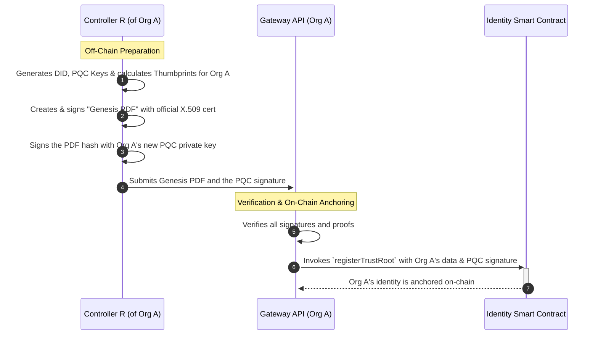
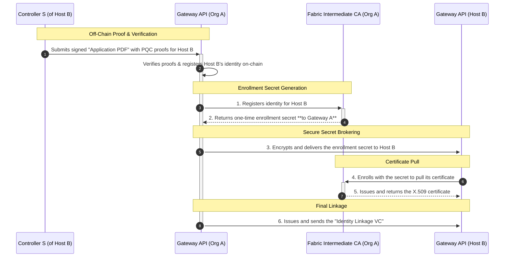
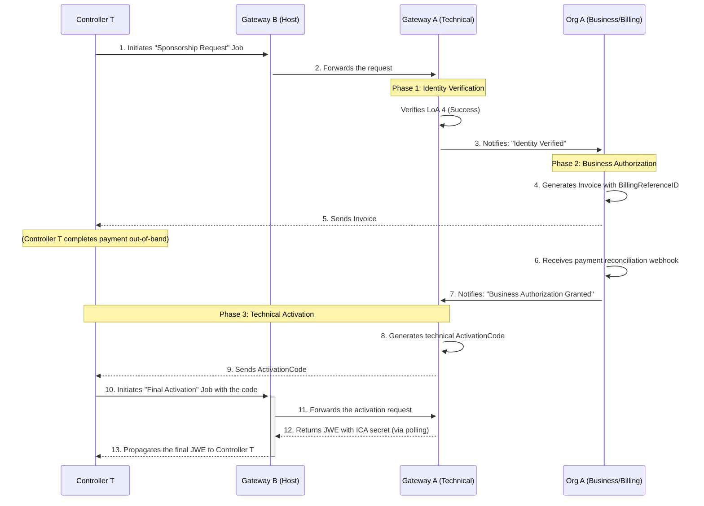

# Guide: Identity Bootstrapping and Trust Model

> **Related Documents:**
> *   **[Trust and Assurance Level Policy (`TRUST_POLICY.md`)](TRUST_POLICY.md)**: Defines the business rules for identity verification.
> *   **[Fabric Implementation Plan (`FABRIC_IMPLEMENTATION_PLAN.md`)](FABRIC_IMPLEMENTATION_PLAN.md)**: Provides the detailed technical plan for implementing this flow.
> *   **[ICA Certificate Issuance + Ledger Registration (`03.H-ICA-CERTIFICATE-ISSUANCE.md`)](03.H-ICA-CERTIFICATE-ISSUANCE.md)**: How certificates are issued and how onboarding evidence is registered on-chain.

## 1. Introduction and Goals

This document provides a comprehensive guide to the identity bootstrapping process for the federated data network. Its purpose is to serve as a canonical reference for developers, system operators, and security auditors.

The primary goal of this architecture is to create a robust, auditable, and cryptographically secure link between an organization's **legal identity** and its **digital operational identities**. The system is designed to be "post-quantum forward" at the application layer while integrating with the existing Public Key Infrastructure (PKI) requirements of Hyperledger Fabric.

## 2. The Golden Rules of Identity

To understand the architecture, it is essential to first understand the three "Golden Rules" that govern how entities are identified within the system.

### Rule 1: `EntityConfig` is Generic
The `EntityConfig` object is a generic container for any entity, be it the Root `Org A`, a `Host B`, or a `Tenant C`. Its structure is consistent, but its content is specific to the entity it represents.

### Rule 2: The Public `did:web` is the Canonical DID Document `id`
For any entity that is meant to resolve on the public web, the DID Document `id` **MUST** be a resolvable `did:web`.

*   **Example for a Tenant:**
    *   `didDocument.id`: `did:web:public.acme.org`

The semantic tenant URN still exists, but it belongs in claims and credential subjects, not as the primary DID Document `id`.

### Rule 3: `alsoKnownAs` is for aliases, not routing
`didDocument.alsoKnownAs` is for alternative public identities or visible aliases such as:

*   the hosted `did:web` under the operator domain
*   a branded public URL
*   the tenant URN when that alias is useful for cross-reference

`alsoKnownAs` **MUST NOT** be treated as the authoritative source of callable API endpoints. Clients must read `didDocument.service[].serviceEndpoint` for invocable URLs.

The same principle applies to employees, who may have multiple email addresses under a single canonical identity.

### The `Host`
The `Host` follows the same public-identity rule: its primary identifier is its public `did:web`.

*   **Example for the Host:**
    *   `didDocument.id`: `did:web:host.example.com`

### Rule 4: `serviceEndpoint` publishes the real operational URL
The DID Document `service[]` array is the runtime contract for SDKs and apps.

*   `#did-document` and `#jwks` point to the public resolution surface.
*   API services such as `#identity:openid:smart:token` point to the real callable endpoint.
*   If a tenant uses a branded public DID but traffic must hit an operator domain, `serviceEndpoint` must publish the operator URL directly.

These rules provide a clear separation between public identity, aliases, and operational routing.

### Rule 5: DCR is technical identity bootstrap, not person-signing bootstrap
Dynamic Client Registration binds the technical runtime identity of a portal, app, or device.

*   DCR keys are transport keys for DIDComm/JOSE and OAuth client authentication.
*   Human actor keys for controller, professional, individual, or related person are a separate identity layer.
*   If GW must publish the initial controller person DID at `Organization/_activate`, the controller public material must arrive explicitly, for example via:
    *   `controller.did`
    *   `controller.sameAs`
    *   `controller.publicKeyJwk`
    *   `controller.jwks`

Do not treat DCR as proof that the controller's personal signing key has been registered unless a separate controller-binding contract says so.

## 3. The Actors

To understand the flow, we define three distinct human controller roles:
*   **Controller R:** The administrator of `Org A` (the network's **R**oot).
*   **Controller S:** The administrator of `Host B` (the **S**ervice Host).
*   **Controller T:** The administrator of `Tenant C` (the **T**enant).

## 4. Core Architectural Principles

The architecture reconciles three identity layers:
4.1.  **Legal Identity Layer:** The foundational trust, established via an official X.509 certificate held by a controller.
4.2.  **Application Identity Layer:** The modern identity layer for APIs, using `did:web`, Post-Quantum Cryptography (PQC), and Verifiable Credentials (VCs).
4.3.  **Network Identity Layer:** The identity for Hyperledger Fabric participation, based on a project-specific X.509 PKI governed by `Org A`.

The **on-chain Identity Smart Contract** serves as the immutable ledger that formally binds these layers together.

## 5. Solving the Bootstrapping Paradox: Seeding the PKI Hierarchy

This process, performed by **Controller R**, is a prerequisite for starting the network. It involves creating a self-signed **X.509 Root CA certificate** off-chain and using it as a "seed" to initialize the Fabric Root CA. The Root CA then issues a certificate to an **Intermediate CA (ICA)**, which will handle all day-to-day certificate issuance. Once the ICA is running, the Fabric network can be started and the Identity Smart Contract can be deployed.

## 6. Phase 1: The Trust Root Bootstrapping Ceremony (Org A)

This phase, orchestrated by **Controller R**, records `Org A`'s identity onto the now-running ledger.

The on-chain `genesisProofSignature` represents a powerful cryptographic statement: **"I, as the controller of the PQC private key whose thumbprint I am registering, attest that this document is the origin of my identity."**

## 7. Phase 2: Participant Onboarding (Host B)

This process describes how `Host B`, managed by **Controller S**, joins the network. `Org A` acts as the governor and broker for network access.

## 8. Phase 3: Tenant Onboarding - From Verification to Activation

The onboarding of a tenant is a multi-phase process that separates cryptographic **Identity Verification** from real-world **Business Authorization**. This ensures that having a valid legal identity (e.g., `LoA 4`) is a prerequisite, but not an automatic grant of access to the network.

### The Onboarding State Machine

A tenant onboarding request progresses through the following states:
1.  `PendingIdentityVerification`: The initial state after the request is submitted.
2.  `PendingStepUpVerification`: If the initial evidence (LoA) is insufficient.
3.  `PendingBusinessAuthorization`: After identity is successfully verified. The request is now awaiting review by `Org A`'s business team.
4.  `PendingFinalActivation`: After business authorization is granted and a final `ActivationCode` has been sent to the user.
5.  `Active`: The onboarding is complete, and the tenant has its Fabric credentials.
6.  `Rejected`: The request was denied at any stage.

### Onboarding notifications (messages)
During onboarding, the legal representative can receive **messages** from the host. These are delivered via the
messaging endpoints and stored in the tenant vault.

Current messages:
- **Order accepted**: confirms the tenant account was created on the host.
- **ICA approved**: contains the ICA enrollment result (certificate + chain).

Message delivery and retrieval:
- Host writes messages to `section=messaging` in the tenant vault.
- Legal representative lists via `_messages` and retrieves via `_get`.
- See `docs/API_INTEGRATORS_GUIDE.md` (Messaging / ICA status notifications) for payload examples.

### The Complete Onboarding Flow

### Flow Description

1.  **Identity Verification:** The flow begins as previously described. `Controller T` initiates a sponsorship request via `Host B`. `Org A`'s technical gateway receives the request and automatically verifies the cryptographic proofs and the Level of Assurance (LoA). Upon success, the request is moved to the `PendingBusinessAuthorization` state, and `Org A`'s business team is notified.

2.  **Business Authorization:** This is a manual, off-chain process. `Org A`'s business team verifies the tenant's suitability for the sector, handles the commercial relationship (licensing, invoicing using a `BillingReferenceID`), and waits for payment reconciliation. Once these business requirements are met, an administrator in the business team approves the request.

3.  **Technical Activation:** The business approval triggers the final technical phase.
    *   `Org A`'s system generates a secure, one-time **`ActivationCode`** and sends it to `Controller T` (e.g., via email).
    *   `Controller T` initiates a new, final asynchronous job, providing this `ActivationCode`.
    *   `Org A`'s technical gateway validates the code. If valid, it finally calls the ICA to generate the enrollment secret, encrypts it for `Controller T`, and makes it available as the final result of the job.
    *   The flow then concludes with the **Re-encryption Ceremony** as described in the `FABRIC_IMPLEMENTATION_PLAN.md`, where `Controller T` uses this secret to provision the `Tenant C` service.

## 9. Phase 4: Operational Identity & Dynamic Control

Once onboarded, an organization can issue credentials. This operational layer is designed to be flexible, especially regarding key rotation.

### Step 9.1: The Role of the Pointer VC

A Pointer VC is a specific type of Verifiable Credential that links a subject's **persistent, semantic identifier** to their **cryptographic controller (DID)**. This is not achieved by placing the controller's DID inside the `credentialSubject`. Instead, the link is established through the credential's **proof**. This model provides a clear separation of concerns:
-   **The `credentialSubject` describes "who or what" the entity is.**
-   **The `proof` describes "who controls" the credential about that entity.**

### Step 9.2: Anatomy of an Operational VC (The Pointer VC Pattern)

All operational VCs (for tenants, employees, etc.) follow a precise structure to prevent identifier ambiguity.

1.  **`vc.id`**: A unique hash derived from the subject's URN and a timestamp. It identifies a **specific instance** of the credential.
2.  **`vc.credentialSubject`**:
    *   **Contains:** Only one identifying property: `identifier`.
    *   **`credentialSubject.identifier`**: The canonical, semantic URN of the subject. This is the persistent, non-changing public identifier.
    *   **`credentialSubject.id`**: This field is **deliberately omitted** to avoid any confusion with `vc.id`.
3.  **`vc.issuer` & `vc.proof`**:
    *   **`issuer`**: The DID of the issuing organization.
    *   **`proof.verificationMethod`**: Combines the **issuer's DID** and a specific key identifier (e.g., `did:web:hostb.example.com#key-1`). It attests to the binding between the `credentialSubject.identifier` and the cryptographic key material.

### Step 9.3: The "Fact-in-Time" Credential vs. The "Live" DID

*   **Verifiable Credential (VC):** A VC is a static assertion, a "fact frozen in time". It certifies the link between a subject's semantic URN and their DID at a specific moment.
*   **DID Document:** A DID Document is a **live representation** of the entity's cryptographic keys, which can and should be rotated.

### Step 9.4: The Verifiable Presentation (VP): Proof of Live Control

When an entity needs to prove their identity, they create a Verifiable Presentation (VP), which is a digital envelope containing the original VC. The entity then **signs the entire VP envelope** using their **current, active private key**.

### Step 9.5: The 3-Step Verification Flow

A verifier performs these checks:
1.  **Verify Live Control (VP Signature):** Verifies the signature on the outer VP envelope using the subject's **current public key** from their live DID document. *This proves the sender is the live controller of the DID.*
2.  **Verify Static Attestation (VC Signature):** Verifies the signature on the inner VC using the **issuer's public key**. *This proves the VC is an authentic statement from a trusted issuer.*
3.  **Connect the Facts:** The verifier reads the trusted statement inside the VC (`urn:tenant:123` is controlled by `did:tenant:xyz`). Since the sender has proven they control `did:tenant:xyz` (Step 1), the verifier concludes the sender is `urn:tenant:123`.

This two-level verification securely bridges the static credential with the dynamic state of the subject's keys.

## 10. The Complete Audit Trail

The architecture is designed for full end-to-end auditability:
1.  **On-Chain Anchor:** Query the smart contract for the participant's key thumbprints and `genesisProofSignature`.
2.  **Legal Basis:** Verify the original signed PDF (provided by the relevant Controller: R, S, or T) against the on-chain proof.
3.  **Application Identity:** Verify the participant's control over their PQC keys.
4.  **Network Identity:** Request the "Identity Linkage VC" and verify the certificate's chain of trust: `Cert -> ICA -> Root CA`.

This layered verification provides a complete, end-to-end chain of trust from the legal document to the operational network certificate.
