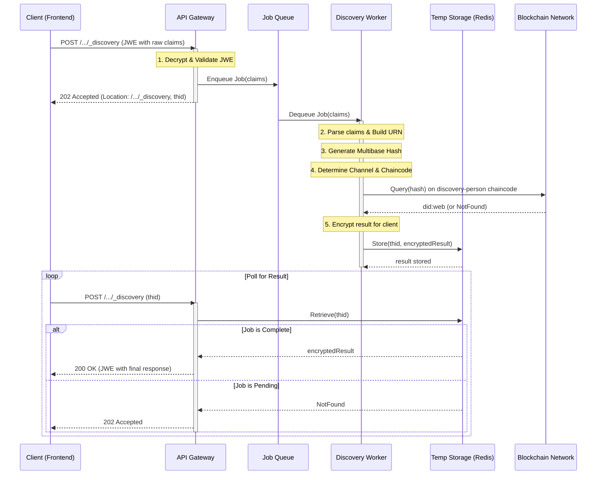

# Architecture: Asynchronous `_discovery` Action for Person

This document specifies the architecture for the `_discovery` action, which enables a trusted party (e.g., a receptionist) to find an individual's `did:web` identifier using a piece of personal information.

The entire process follows the established asynchronous, privacy-preserving architectural pattern.

## 1. Architectural Principles

-   **Simple Client, Smart Backend:** The client (frontend) is a simple form that submits raw personal data. All complex logic (URN construction, hashing, blockchain routing) is centralized in the backend.
-   **Backend Hashing:** For the MVP, the backend is responsible for generating the canonical URN and its corresponding multibase hash. This simplifies client-side development. The data is protected in transit by a JWE envelope.
-   **Convention over Configuration:** The system uses information from the API request path (`sector`, `resource type`, `action`) and a minimal set of claims to dynamically determine the correct blockchain channel and smart contract to query.
-   **Standard Flat Claims:** The request uses the established `flat claims` model (`ClaimsPersonSchemaorg`), ensuring consistency across the API.
-   **Asynchronous Flow:** The action is non-blocking. The client submits a job and polls for the result, which is ideal for potentially long-running blockchain queries.

## 2. Endpoint Definition

-   **Method:** `POST`
-   **Path:** `/{tenantId}/cds-{jurisdictionCode}/v1/{sector}/org.schema/Person/_discovery`
-   **Action Name:** `_discovery`

## 3. Asynchronous Flow

The interaction is a two-phase process.

### Phase 1: Job Submission

1.  The client constructs a DIDComm payload containing the discovery claims.
2.  This payload is signed (JWS) and encrypted (JWE).
3.  The client sends a `POST` request to the `_discovery` endpoint with the JWE as a form parameter.
4.  The server validates the request, queues a new discovery job, and immediately responds with **`202 Accepted`**.
5.  The response includes a `Location` header pointing to the same endpoint for polling.

### Phase 2: Result Polling

1.  After a short delay, the client sends a `POST` request to the `Location` URL from Phase 1.
2.  This request contains only the `thid` (thread ID) from the original request, sent as a form parameter.
3.  If the job is complete, the server responds with **`200 OK`**, and the body contains the final, encrypted (JWE) response from the worker.
4.  If the job is still pending, the server may respond with `202 Accepted` again.

## 4. Request Structure

### 4.1. Outer Envelope (Job Submission)

The client sends the request with `Content-Type: application/x-www-form-urlencoded`.

```
request=eyJhbGciOiJYS0...
```

### 4.2. Inner DIDComm Payload (Decrypted JWE Content)

This is the JSON object inside the JWE. It uses `flat claims` to specify the search criteria.

```json
{
  "thid": "thid-discover-e2e-1678886400",
  "aud": "did:web:api.acme.org",
  "iss": "did:web:api.acme.org:employee:receptionist1@api.acme.org:role:...",
  "body": {
    "data": [
      {
        "type": "Person-discover-v1.0",
        "meta": {
          "claims": {
            "org.schema.Person.identifier.additionalType": "JHNES-CL",
            "org.schema.Person.identifier.value": "1234567890"
          }
        }
      },
      {
        "type": "Person-discover-v1.0",
        "meta": {
          "claims": {
            "org.schema.Person.telephone": "+34600123456"
          }
        }
      }
    ]
  }
}
```

## 5. Backend Worker Logic (`DiscoveryManager`)

The asynchronous worker executes the following logic for each entry in the `data` array:

1.  **Receive Claims:** Get the `claims` object.
2.  **Parse Identifier Type:**
    -   If the claim is an `identifier` (e.g., `org.schema.Person.identifier.additionalType`), it calls a `parseIdentifierType` utility.
    -   **Parsing Logic for `JHNES-CL`:**
        1.  Remove subdivision suffix (`-CL`) -> `JHNES`.
        2.  Extract 2-letter country code from the end -> `ES`.
        3.  The remainder is the identifier type -> `JHN`.
    -   If the claim is not an `identifier` (e.g., `telephone`), this step is skipped.
3.  **Determine Jurisdiction Group:**
    -   For identifiers, the extracted country code (`ES`) is mapped to a group (e.g., `eu`).
    -   For all other claims, the group is `global`.
4.  **Construct URN:** Based on the type and jurisdiction, build the canonical URN.
    -   *Example:* `urn:network:eu:identifier:JHNES-CL:1234567890`
5.  **Generate Hash:** Call `generateUrnHash()` on the URN to get the multibase hash (URN normalization is done)
6.  **Determine Blockchain Target:**
    -   **Channel Name:** `/{sector}-{jurisdictionGroup}` (e.g., `health-care-eu`).
    -   **Chaincode Name:** `/{action}-{resource}` (e.g., `discovery-person`).
7.  **Query Blockchain:** The adapter calls the specified chaincode on the correct channel with the hash.
8.  **Prepare Response:** The worker stores the result (the found `did:web` or a "not found" error) in a temporary storage (e.g., Redis) using the `thid` as the key. The response is encrypted for the original issuer.

## 6. Final Response Structure (Decrypted from Polling)

The decrypted response from the polling endpoint is a standard `batch-response`.

```json
{
  "thid": "thid-discover-e2e-1678886400",
  "iss": "did:web:api.acme.org",
  "aud": "did:web:api.acme.org:employee:receptionist1@api.acme.org:role:...",
  "body": {
    "type": "batch-response",
    "data": [
      {
        "response": {
          "status": "200",
          "location": "did:web:api.acme.org:individual:multibase:z123abc..."
        },
        "meta": { ...original meta from request... }
      },
      {
        "response": {
          "status": "404",
          "outcome": {
            "issue": [{ "diagnostics": "Identifier not found on the network." }]
          }
        },
        "meta": { ...original meta from request... }
      }
    ]
  }
}
```

## 7. Sequence Diagram

This diagram illustrates the complete asynchronous flow, from the initial client request to the final retrieval of the discovery result.



## 8. Blockchain Batch Optimization: "First Match Wins"

A critical performance optimization must be implemented at the blockchain layer (specifically, in the smart contract).

While the `CustomerManager` prepares and sends a full batch of hashes for a given person to a specific channel (e.g., `['nnes_hash', 'passport_hash']` to the `eu` channel), the smart contract **should not** waste resources by processing the entire list if a match is found early.

### Smart Contract Logic

-   The smart contract (e.g., `discovery-person`) must expose a function that accepts an **array of hashes** (e.g., `discoverByAnyHash`).
-   This function **must iterate** through the received hashes in order.
-   The moment it finds a hash that exists in its ledger, it retrieves the associated `did:web`.
-   It **must immediately stop processing** and return the single `did:web` it found.
-   To fulfill the adapter's interface contract, the smart contract's response should be an array of the same length as the input, with the found DID at the correct index and `undefined` or `null` for all other positions. For example, if the first hash was the match, the return value would be `['did:web:found-did', undefined, undefined, ...]`.

This "first match wins" approach ensures that discovery is as fast as possible, only performing the minimum number of reads required to find a person's identity. The `CustomerManager` remains unaware of this optimization, keeping the application logic clean and decoupled from the blockchain implementation.

