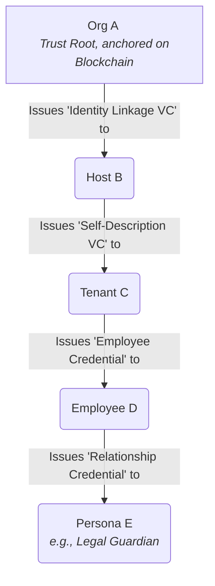

# Verifiable Credential (VC) Architecture

This document specifies the architecture for issuing and managing Verifiable Credentials, designed to be compliant with modern identity standards and the principles of federated ecosystems.

## 1. Core Principles & Goals

-   **Interoperability:** To produce standards-compliant Verifiable Credentials for federated data spaces.
-   **Decoupling:** To separate the cryptographic proof from the underlying claims.
-   **Traceability & Auditability:** To ensure every credential issuance is a unique, deterministic, and traceable event.
-   **Extensibility:** To use a semantic and machine-readable identity model that can evolve without breaking changes.

## 2. The "Pointer Credential" Pattern

We issue **Pointer Credentials**. The `credentialSubject` is minimal and contains only one property: the `identifier`, which is the entity's stable and globally unique **Semantic URN**.

Example: 
```json
"credentialSubject": {
  "identifier": "urn:unid:test-network:cds-es:v1:health-care:entity:tax:B0011223344"
}
```

## 3. The Identity Model: Semantic Identifiers

The identifier is a machine-readable composite string built from two distinct parts: a **Context Prefix** and a sequence of one or more **Attribute Segments**.

**Overall Pattern:**
`<Context_Prefix>:<Attribute_Segment_1>:<Attribute_Segment_2>:<...>`

### 3.1. Context Prefix

This is the static, foundational part of the identifier. It establishes the "who" and "where" of the data space—the namespace, network, and governance rules.

-   **Structure:** `urn:<namespace>:<network>:<jurisdiction>:<version>:<sector>`
-   **Example:** `urn:unid:test-network:cds-es:v1:health-care`

### 3.2. Attribute Segments

These are dynamic, three-part segments that are appended to the Context Prefix. They describe the "what"—the specific, verifiable attributes of the entity.

-   **Strict Pattern:** Each segment **MUST** follow the structure: `attribute-name:attribute-type:attribute-value`

### 3.3. Full Identifier Examples

-   **Organization Identifier:** The primary identifier for a tenant.
    -   **Resulting Identifier:** `urn:unid:test-network:cds-es:v1:health-care:entity:tax:B0011223344`

-   **The Connection Pattern (For Individuals):** An anchor for all individual-related interactions, acting as a stable, opaque proxy.
    -   **Resulting Identifier:** `urn:unid:test-network:cds-es:v1:health-care:entity:alternatename:acme:connection:uuid:<uuid-v4>`

-   **Related Person Identifier (e.g., a parent of a child patient):**
    -   **Base:** Connection URN
    -   **Attribute Segment 3:** `related:ppnes:A1234567B` (Identifies the related person, e.g., by passport number)
    -   **Attribute Segment 4:** `role:relationship:PRN` (Defines the relationship, e.g., Parent)
    -   **Resulting Identifier:** `...:connection:uuid:<uuid>:related:ppnes:A1234567B:role:relationship:PRN`

-   **Professional Access Identifier (e.g., a doctor):**
    -   **Base:** Connection URN
    -   **Attribute Segment 3:** `employee:email:doctor@hospital.example.com`
    -   **Attribute Segment 4:** `role:isco-08|2211` (Defines the professional role)
    -   **Resulting Identifier:** `...:connection:uuid:<uuid>:employee:doctor@hospital.example.com:role:isco-08|2211`

-   **Individual Attribute Identifiers:** Specific URNs representing a single, verifiable attribute of an individual, linked to their tenant-specific UUID.
    -   **Date of Birth:** `...:entity:alternatename:acme:individual:uuid:<uuid-v4>:dob:iso:1990-01-15`
    -   **Legal Name:** `...:entity:alternatename:acme:individual:uuid:<uuid-v4>:legalName:icao9303:DOE<<JANE`
    -   **Driver's License:** `...:entity:alternatename:acme:individual:uuid:<uuid-v4>:identifier:dl-ca-bc:1234567`

## 4. The "Versioned Credential ID" Pattern

To ensure every issuance is a unique, auditable, and content-addressed event, the `id` of the Verifiable Credential itself is **deterministic and versioned**. It is generated by cryptographically hashing the canonical representation of the credential's data.

### 4.1. Generation Logic

The ID is generated from a simple, deterministic string, ensuring that the same input always produces the same output.

1.  A deterministic input string is constructed by concatenating the subject's canonical identifier and the credential's issuance timestamp (in Unix epoch seconds):
    -   **Pattern:** `<credentialSubject.identifier>:timestamp:epoch:<validFrom_epoch>`
    -   **Example:** `urn:unid:...:tax:B123...:timestamp:epoch:1759161600`
2.  The byte representation of this string is computed (UTF-8).
3.  The SHA3-256 hash of the byte array is computed.
4.  This raw hash digest is then encoded using the **Multihash** format, which prepends the digest with a code identifying the hash algorithm (`0x14` for `sha3-256`) and its length (`0x20` for 32 bytes).
5.  The resulting Multihash byte array is then encoded into a string using the **Multibase** format (`base58btc`, prefixed with `z`).
6.  The final `vc.id` is formatted as a URN: `urn:multibase:<multibase-encoded-string>`.

### 4.2. Advantages

-   **Content-Addressable:** The ID is a direct, verifiable fingerprint of the credential's content at the time of issuance.
-   **Algorithm Agility:** The use of Multihash and Multibase makes the system future-proof. New hash algorithms or encoding schemes can be adopted without breaking the ID format.
-   **Interoperability:** This pattern is aligned with best practices from decentralized systems and IETF standards for maximum interoperability.
-   **Implicit Traceability:** While the timestamp is not explicitly in the ID, it is part of the canonical data that is hashed, cryptographically binding the issuance time to the ID.

This architecture provides a professional, flexible, and standards-aligned foundation for our verifiable data ecosystem.

## 5. API Endpoints for Credential Issuance & Retrieval

The gateway exposes a set of secure, action-oriented RESTful endpoints consistent with the routing structure (inspired by both the Consumer Data Standards or CDS and HL7 FHIR API). All requests that may contain identifying information **MUST** use the `POST` method to ensure parameters are sent securely in the request body.

### 5.1. Endpoint Structure

-   **Path Pattern:** `POST /:tenantId/cds-:jurisdiction/v1/:sector/entity/credential/:resourceType/:action`
-   **Request Body:** A JSON object with parameters to identify the specific resource instance.
-   **Response Format:** The client specifies the desired response format via the `Accept` header or an internal `response_type` parameter.

#### 5.1.1. Content Negotiation

The API supports two methods for a client to specify the desired response format, ensuring compatibility with both direct RESTful calls and encapsulated security protocols like JARM.

1.  **Direct API Calls (Default):** For standard RESTful requests, the client **MUST** use the standard HTTP `Accept` header.
    -   *Example:* `Accept: application/vc+ld+json`

2.  **Encapsulated Requests (e.g., DIDComm, JARM/FAPI):** When the request is wrapped in a secure envelope (like a JWT) and sent with a `Content-Type` of `application/x-www-form-urlencoded`, the HTTP `Accept` header describes the transport format, not the desired business logic response. In this case, the client **MUST** specify the desired credential format inside the decoded request payload using the `response_type` parameter.
    -   *Example (inside the decoded JWT payload):* `"response_type": "application/vc+jwt"`

The server logic will prioritize the `response_type` parameter from the request body if it exists. If not, it will fall back to using the HTTP `Accept` header.

### 5.2. Supported Resource Types (`:resourceType`)

-   **`Organization`**: Represents the tenant entity itself.
-   **`EmployeeRole`**: Represents a specific role held by an employee.
-   **`PractitionerRole`**: The equivalent for FHIR-enabled sectors.

### 5.3. Actions (`:action`)

#### `_search` (Retrieve Credential Data)

Retrieves the credential in various standard formats.

-   **Example:** `POST /acme/cds-es/v1/health-care/entity/credential/Organization/_search`
-   **`Accept` Header Negotiation:**
    -   `Accept: application/vc+ld+json` (Default)
    -   `Accept: application/vc+jwt`
    -   `Accept: text/plain` (For the raw detached JWS)

#### `_oob` (Generate Connection Invitation)

Generates a DIDComm Out-of-Band (OOB) message and returns it as a QR code.

-   **Example:** `POST /acme/cds-es/v1/health-care/entity/credential/Organization/_oob`
-   **`Accept` Header Negotiation:**
    -   `Accept: image/png` (Default)
    -   `Accept: image/jpeg`
    -   `Accept: image/svg+xml`

#### `_verify` (Verify a Credential)

A global action, separate from the CDS structure.

-   **Endpoint:** `POST /_verify`
-   **Request Body:** The full VC JSON object to be verified.
-   **Response:** A verification report.

## 6. Credential Discovery

For the system to be interoperable, clients must have a standard way to discover how to use the core API.

### 6.1. Organization Self-Description

The primary credential for the Organization is made discoverable via a simple, public `GET` request to a `.well-known` path. This provides a predictable entry point for ecosystem crawlers.

-   **Endpoint:** `GET /:tenantId/cds-:jurisdiction/v1/:sector/entity/.well-known/self-description.json`
-   **Description:** This endpoint returns a small JSON object that points to the secure `_search` API, instructing clients on how to retrieve the full credential.

### 6.2. Employee and Role Credentials

Discovering how to request credentials for specific resources (like an `EmployeeRole`) is handled through the **Organization's DID Document**. The `did.json` will contain `service` entries of type `CredentialIssuanceService`, which provide a template for the API endpoint URL and the required schema for the `POST` request body, allowing for fully automated discovery.

## 7. Verifiable Credential Types and Use Cases

The hierarchical identifier model allows for a variety of credential types, each tailored to a specific purpose.

### 7.1. Relationship Credential

This credential type is used to prove that a specific, identified person has a verifiable relationship (e.g., parent, guardian) to the subject of a connection. It is base on the 

-   **`credentialSubject.identifier`**: The full URN of the relationship, e.g., `...:connection:uuid:<uuid>:related:ppnes:A1234567B:role:relationship:PRN`.
-   **Content:** The `credentialSubject` can contain additional details about the relationship, such as the validity period.
-   **Purpose:** Allows a parent or guardian to present a credential that proves their authority over the child's connection DID, enabling them to act on the child's behalf.

### 7.2. Professional Access Credential

This credential grants a professional temporary, auditable access to the data associated with a connection.

-   **`credentialSubject.identifier`**: The full URN of the professional access role, e.g., `...:connection:uuid:<uuid>:employee:doctor@acme.org:role:isco-08|2211`.
-   **Content:** The `credentialSubject` typically includes a `scope` or `permissions` field detailing what actions are permitted (e.g., `read:medical_history`).
-   **Purpose:** Replaces traditional access control lists with a portable, verifiable, and time-bound authorization token.

### 7.3. Personal Data Credential (Static)
This credential type uses a salted hash of a single attribute, but it is pre-issued and held by the user. It is suitable for low-assurance scenarios. The verification flow requires the verifier to obtain the salt from the provider to validate the hash.

### 7.4. Dynamic Verification Protocol (High-Assurance)

For high-assurance scenarios (e.g., identity verification, age confirmation), a dynamic protocol is used. This flow generates a purpose-specific, short-lived proof based on real-time consent and data possession by the controller.

**Core Principle:** The Provider's database stores **hashes of full, semantic URNs**, not hashes of raw data. The verification confirms that the controller can provide the exact data needed to reconstruct a specific URN that the Provider knows.

**The Flow:**

1.  **Verification Request (Verifier -> Provider):** The Verifier initiates a check for a specific user session, asking to verify a particular attribute, e.g., "Confirm the identity of the user presenting DNI `12345678Z`."

2.  **Data Provision Request (Provider -> Controller):** The Provider does not ask for simple consent. It sends a prompt to the user's controller: "Verifier 'XYZ Corp' wants to confirm your DNI. To proceed, please enter your DNI. This data will NOT be shared, only the verification result."

3.  **Data Provision (Controller -> Provider):** The controller enters the DNI (`12345678Z`).

4.  **Semantic URN Lookup (Provider Internal):**
    a. The Provider uses the data from the controller and the user's context (e.g., their tenant-specific UUID) to construct the full, expected semantic URN: `urn:...:individual:uuid:<user-uuid>:nn:es:12345678Z`.
    b. It then cryptographically hashes this entire URN string.
    c. It searches its database for an exact match of the **hashed URN**. A match proves, in real-time, that the person providing the data is the legitimate owner of that recorded attribute.

5.  **JIT Proof Generation:** Upon a successful lookup, the Provider generates a new, ephemeral (short-lived) Verifiable Credential containing only the verification result, not the data itself.
    ```json
    "credentialSubject": {
      "id": "...:connection:uuid:<uuid>",
      "assertion": {
        "type": "IdentityVerification",
        "attribute": "nn:es",
        "isMet": true
      }
    }
    ```

6.  **Asynchronous Response & Retrieval:** The Provider returns a `202 Accepted` with a `thid`. The Verifier then polls a separate endpoint with the `thid` to retrieve the ephemeral VC once it's ready.


## 8. Credential Lifecycle and Issuance Strategy

The structural principles defined above are the foundation for a dynamic and secure credential lifecycle. This section outlines the strategic rules governing *how* and *why* credentials are issued, creating a hierarchical and auditable trust ecosystem.

### 8.1. The Principle of Conditional Issuance

The issuance of a Verifiable Credential, especially one signed by a higher-level authority (like the Host), is not an automatic administrative act. It is the **cryptographic reward for a successful verification of evidence**.

A credential is only issued and signed when the evidence provided by the subject meets a predefined policy. The rules for this are formally defined in the **[Trust and Assurance Level Policy (`TRUST_POLICY.md`)](TRUST_POLICY.md)**.

**Primary Example: Tenant Self-Description**
-   A `Tenant C` is only granted a `Self-Description` credential signed by `Host B` if `Controller T` provides `LoA 4` evidence (e.g., a qualified digital signature) during the onboarding process. If the evidence is of a lower grade, the credential is not issued until a "step-up" verification is complete.

### 8.2. The Hierarchical Trust Model (Chain of Trust)

The authority to issue trusted credentials flows downwards from the root of the network in a clear, auditable chain.



-   **`Org A`:** The ultimate trust anchor. Its authority is established by the on-chain `IdentityContract`.
-   **`Host B`:** Receives its authority to act as an issuer from `Org A`.
-   **`Tenant C`:** Receives its authority from `Host B`. Its `Self-Description` VC is the proof that it is a legitimate member of the ecosystem.
-   **`Employee D`:** Receives authority from their employer, `Tenant C`.
-   **`Persona E`:** Can receive specific, purpose-driven credentials from an authorized employee.

### 8.3. The Critical Role of `evidence`

Every credential issued within this hierarchy **MUST** contain an `evidence` property that provides a verifiable trail for *why* the credential was issued. This is essential for auditability and for verifiers to assess the true strength of a claim.

-   **Tenant Self-Description `evidence`:**
    ```json
    "evidence": [{
      "type": "DigitalCertificateVerification",
      "verifier": "did:web:hostb.com",
      "assuranceLevel": "LoA-4",
      "certificateDetails": { ... }
    }]
    ```
-   **Employee Credential `evidence`:**
    ```json
    "evidence": [{
      "type": "PhysicalDocumentVerification",
      "verifier": "did:employee:manager-xyz",
      "document": { "type": "IDCard", "country": "ES" }
    }]
    ```

### 8.4. Hybrid Credential Strategy (Online/Offline)

To support real-world use cases where network connectivity is not guaranteed (e.g., physical access control), the system supports a hybrid credential model, particularly for employee credentials. This model is inspired by the [W3C CCG VC-Barcodes Specification](https://w3c-ccg.github.io/vc-barcodes/).

1.  **The Online Credential (Primary):** This is the full Verifiable Credential, signed with a strong, post-quantum algorithm (ML-DSA). It is stored in the tenant's vault and is the primary source of truth. It has a canonical URL for retrieval.

2.  **The Offline Artifact (Secondary):** This is a physical or digital representation, such as a **PDF417 barcode** on an ID card.
    *   **Content:** The barcode contains a minimal set of human-readable claims, a **classical digital signature (Ecdsa)**, and the **URL to the full Online Credential**.
    *   **Dual Verification Flow:**
        *   **Offline Verification:** A device without internet access can scan the barcode and validate the Ecdsa signature against a known public key of the issuer. This provides a baseline level of trust.
        *   **Online Verification:** A connected device can scan the barcode, extract the URL, retrieve the full VC, and verify the much stronger ML-DSA signature. It can also check the revocation status via the blockchain.

### 8.5. The Role of the `CredentialManager`

The `CredentialManager` is not a high-level business logic component. It is a low-level **cryptographic engine** responsible for the mechanics of credential issuance.

-   **Function:** It exposes methods like `signTenantSelfDescription`, `signEmployeeCredential`, etc.
-   **Invoked By:** Higher-level business managers (`HostingManager`, `EmployeeManager`).
-   **Process:**
    1.  A business manager (e.g., `HostingManager`) validates a business process (e.g., tenant registration with `LoA 4`).
    2.  The business manager constructs the `claims` and `evidence` for the new credential.
    3.  It calls the `CredentialManager`, passing the unsigned credential data and the identifier of the key to be used for signing (e.g., the `Host`'s key or the `Tenant`'s key).
    4.  The `CredentialManager` handles the canonicalization, hashing, interaction with the KMS for signing, and assembly of the final, signed VC object.