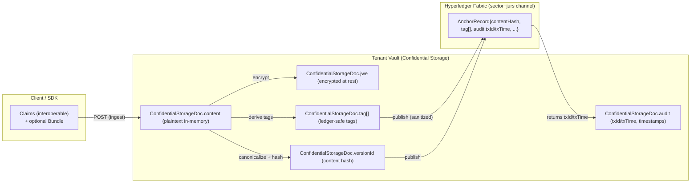

An artifact/document hash is computed from the **canonical representation** of the artifact:
- Example artifacts: FHIR Bundle `document`, DICOM manifest, lab report PDF, signed practitioner statement, device-generated report.
- The canonical bytes must be defined (e.g., canonical JSON, PDF bytes, JWS payload bytes, etc.).

This hash is what gets anchored/certified on the ledger.

---

## 3) Attestation: signatures, provenance, and algorithms

For professional-grade artifacts, the anchoring record MAY carry:
- `hash` (required)
- `hashAlg` (e.g., `SHA-256`)
- `signatures[]` (optional): signature(s) over the artifact hash or over the canonical artifact bytes
- `signAlg` (e.g., ML-DSA variant, EdDSA, etc.)
- `signer` identity (e.g., DID + `kid`)
- `policyRef` (optional): versioned policy/ruleset identifier
- `time` (transaction timestamp / block time)

Relationship to FHIR:
- **FHIR `Signature`** can represent signatures on resources/documents.
- **FHIR `Provenance`** can represent who created/recorded/transformed the artifact, and can carry signature references.

The platform design aims to keep:
- clinical content in tenant storage,
- attestations and non-sensitive anchors in the ledger,
- and links between them via hash + provenance references.

---

## 4) Research/routing tags (ledger-safe)

### 4.1 Where tags live

In this platform, derived **research/routing tags** are not embedded into `resource.meta.tag` (FHIR).

Instead they live:
- **at the bundle level** in the payload: `body.meta.tag[]` (for FHIR bundle payloads), and/or
- **outside encrypted content** at rest: `ConfidentialStorageDoc.tag[]`.

This prevents mixing platform metadata with clinical resources and allows tags to exist without mutating the original artifact/document.

### 4.2 Tag `id` uniqueness and indexing

Since a bundle may contain multiple resources of the same type, `tag.id` must be unique and SHOULD be indexed per resource type:
- `Observation[0].code`
- `Observation[1].code`
- `MedicationStatement[0].medication-code`

Indexing starts at `0` and resets per resource type.

### 4.3 Ledger safety rule

`tag.display` is allowed for UI/review, but MUST be removed (or allowlisted) before writing to any shared ledger.
Enforcement should exist in two places:
- backend sanitization/allowlist,
- chaincode/smart-contract validation.

### 4.4 Simplified mapping (vault vs API vs ledger)

If your goal is research routing + anchoring (not full clinical exchange), you often do **not** need to publish the derived entries/resources themselves:
- The **vault** keeps the encrypted content (`content` → `jwe`), including the original entries/claims.
- The vault also stores:
  - `ConfidentialStorageDoc.tag[]`: the aggregated, ledger-safe tags derived from the encrypted content (indexed with `Observation[0]...` when needed).
  - `ConfidentialStorageDoc.versionId`: a deterministic **content hash** (recommended) for the canonicalized claims/artifact.
  - `ConfidentialStorageDoc.audit`: reserved for **ledger attestation** (`txId`, `txTime`) and lifecycle metadata (`created`, `updated`, etc.).

For **ledger publication**, the minimal payload is typically:
- `contentHash` (or `versionId` if you use it as the content hash),
- `tag[]` (ledger-safe allowlist: `id/system/code/version/userSelected`),
- optional signature/provenance references.

This keeps the ledger independent of FHIR rendering/versioning and avoids leaking content.

---

## 5) Channel naming (sector + jurisdiction)

The Fabric channel name is derived from:
- the **sector** (e.g., `health-care`, `insurance`, `emergency`)
- the **jurisdiction group** (e.g., `eu` vs `global`), derived from jurisdiction/country code rules.

Current backend routing uses a simplified naming scheme:
- `channel = "${sector}-${jurisdictionGroup}"`
  - Example: `health-care-eu`
  - Example: `insurance-global`

Reference implementation:
- `gwtemplate-node-ts/src/utils/jurisdiction.ts` (`getJurisdictionGroup`)
- `gwtemplate-node-ts/src/managers/IndividualManager.ts` (builds `${sector}-${jurisdictionGroup}`)

Note: longer, fully-qualified channel names (including environment/version) are a target architecture concern and can be layered later.

---

## 6) Professional-certified vs patient-provided data

### 6.1 Professional-certified artifacts

Professional-certified artifacts (e.g., hospital discharge summary, lab result, practitioner-signed document) are candidates for:
- strong attestation (signatures + provenance),
- ledger anchoring on sector/jurisdiction channels,
- cross-org verification.

### 6.2 Patient/caregiver/family-provided data (userSelected)

Patient-provided data is typically:
- versioned and managed within the tenant vault,
- protected at rest in Confidential Storage,
- optionally transformed/anonymized for research/AI use under policy.

These records MAY produce derived tags and derived “digital twin” artifacts, but those are not automatically treated as professional-certified.

---

## 7) Digital twin / AI store (policy-dependent)

For research/AI, the platform may maintain a separate store/network for “digital twin” artifacts:
- anonymized conversations,
- anonymized IPS-like summary,
- derived tags.

This is intentionally separated from:
- sector/jurisdiction channels used for professional-certified clinical artifacts.

Wearable traceability (if needed) can be handled in this digital twin store/network, or by a dedicated device-attestation subsystem, but it must not overload the professional clinical anchoring channels.

---

## 8) Smart-contract behavior: de-duplication and anchoring

A typical private chaincode pattern for anchoring:
- Input: `{ hash, hashAlg, tags?, signatures?, policyRef? }`
- Behavior:
  - If `hash` already exists: reject or return “already anchored” (depending on policy).
  - Otherwise: store an anchoring record (plus timestamp/txId).

This prevents accidental re-publication and supports consistent auditing.
