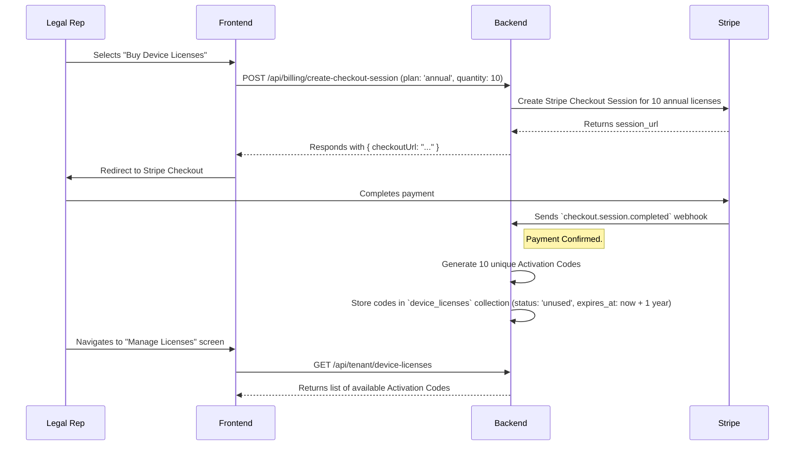
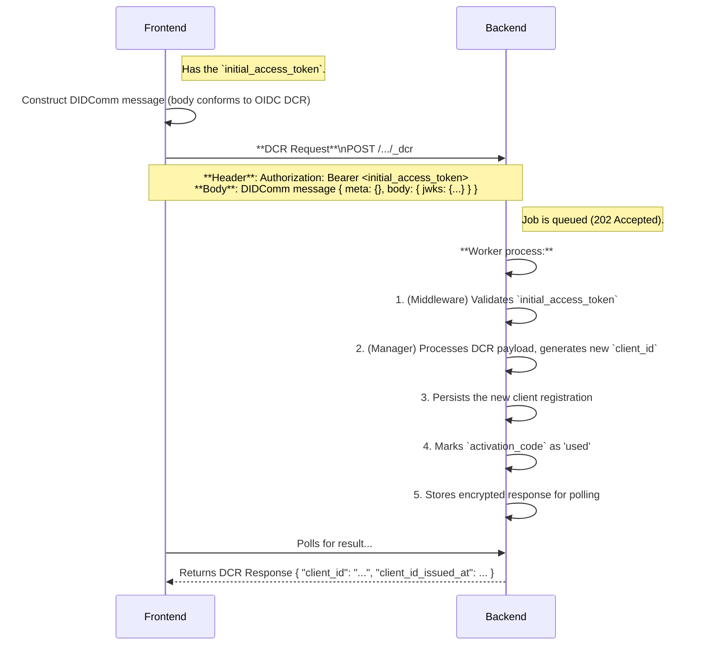

# End-to-End Device Registration and Activation Flow
## (Enabling SMART App Launch)

## 1. Overview

This document outlines the complete, end-to-end flow for registering a new device on the platform. The process is designed to be robust, secure, and standards-based, serving as the foundational step for subsequent secure interactions like SMART App Launch.

The architecture combines three distinct phases:
1.  **License Acquisition**: A business-level process where an organization purchases the rights to connect devices.
2.  **Token Exchange**: A security-level process where a user proves their identity and possession of a license to get a short-lived permission to act.
3.  **Dynamic Client Registration (DCR)**: A technical-level process where the device registers its cryptographic identity with the server.

### Actors

*   **Legal Representative**: An administrator of a tenant organization.
*   **End User**: A member of the organization who needs to register their device.
*   **Frontend**: The web or mobile application.
*   **Backend**: The gateway server.
*   **Stripe**: The third-party payment processor.
*   **Identity Provider (IdP)**: The OIDC service for user authentication (e.g., Firebase Auth).

## 2. Phase 1: License Acquisition (Business Flow)

This phase is performed by the Legal Representative.



## 3. Phase 2: Device Activation (Security & Technical Flow)

This phase is performed by the End User. It consists of two distinct API calls.

### Step 2.1: The Token Exchange

The user exchanges their identity (`id_token`) and their authorization (`activation_code`) for a temporary, single-purpose access token.

*   **Endpoint**: `POST /auth/token`
*   **Purpose**: To securely convert a long-lived, human-readable activation code into a short-lived, machine-readable access token with a tightly scoped permission.

```mermaid
sequenceDiagram
    participant End User
    participant Frontend
    participant IdP
    participant Backend

    End User->>Frontend: Logs in
    Frontend->>IdP: OIDC Login Flow
    IdP-->>Frontend: Returns `id_token`

    End User->>Frontend: Enters the Activation Code
    
    Frontend->>Backend: **Token Exchange Request**\nPOST /auth/token
    Note over Frontend,Backend: **Header**: Authorization: Bearer <id_token><br/>**Body**: { grant_type: "token-exchange", subject_token: "<activation_code>" }

    Backend->>Backend: 1. Verify `id_token` (User is authenticated)
    Backend->>Backend: 2. Verify `activation_code` in DB (is 'unused' and not expired?)
    Backend->>Backend: 3. If valid, mark code as 'pending'
    Backend->>Backend: 4. Generate `initial_access_token` (expires in 60s, scope: 'dcr:register')
    
    Backend-->>Frontend: Returns `{ "initial_access_token": "..." }`
```

### Step 2.2: The Dynamic Client Registration

With the temporary access token, the frontend now has permission to make the actual DCR call.

*   **Endpoint**: `POST /:sector/entity/openid/device/_dcr`
*   **Purpose**: To register the device's cryptographic identity (its public keys) with the server and receive a unique `client_id`.



## 4. Enabling the Future: SMART App Launch

This entire DCR flow is the mandatory **Step 0** for enabling a high-security **SMART App Launch**, which relies on asymmetric cryptography (`private_key_jwt`).

**The connection is the `jwks` (JSON Web Key Set).**

1.  **Registration (DCR Flow)**: The device (the SMART App) generates a public/private key pair. During the DCR process documented above, it sends its **public keys** to the server inside the `jwks` parameter. The server stores these public keys and associates them with the newly generated `client_id`.

2.  **Authentication (SMART App Launch Flow)**: When the user wants to launch the SMART App:
    *   The app creates a JWT and signs it with its **private key**. This JWT includes claims like `iss` (its own `client_id`) and `aud` (the FHIR server's token endpoint). This is the `private_key_jwt`.
    *   The app sends this signed JWT to the FHIR server's `/token` endpoint as part of the request for an access token.
    *   The FHIR server receives the JWT. It extracts the `client_id` from the payload.
    *   It uses the `client_id` to look up the client's registration data—specifically, the **public keys** that were stored during the DCR flow.
    *   It uses the retrieved public key to **verify the signature** of the JWT.

**Conclusion:** The DCR flow is the mechanism that securely establishes the cryptographic trust relationship between the client and the server. Without registering its public keys first, a client would be unable to authenticate itself using the `private_key_jwt` method required for a secure SMART App Launch wrapped in a DIDComm payload. This architecture correctly separates the one-time registration event from the recurring authentication events.
